## 🌀 Naruto Hand Signs Detection Web App

This project is a **simple web application** that performs **real-time Naruto hand sign detection** using **YOLOv8n** and **Streamlit**.  
We **created our own custom dataset** of Naruto hand signs and **manually annotated** it using **CVAT**, combining it with other open-source datasets for best results.  
It allows users to visualize the live camera feed and see the predicted hand sign in real time.

---

### 🎥 Demo
<video src="https://github.com/Nightshader07/ForumApp/raw/main/assets/demo.mp4" controls width="700"></video>

---

### 🎥 Dataset Creation
[Demo Video](assets/signs.mp4)

---

### 🚀 Features
- **Live hand sign detection** via webcam  
- **Trained with YOLOv8n** (Ultralytics)  
- **Streamlit-based web UI**  
- **High accuracy** across all classes  
- Supports **13 Naruto hand signs** + background detection  

---

### 📦 Installation

```bash
git clone https://github.com/Nightshader07/ForumApp.git
cd ForumApp
pip install -r requirements.txt
```

---

### ▶️ Run the Web App

```bash
streamlit run app.py
```

Make sure all the **images** (listed below) and your **YOLO model weights** are located in the same folder as `app.py`.

---

### 📊 Model Performance

#### Confusion Matrix
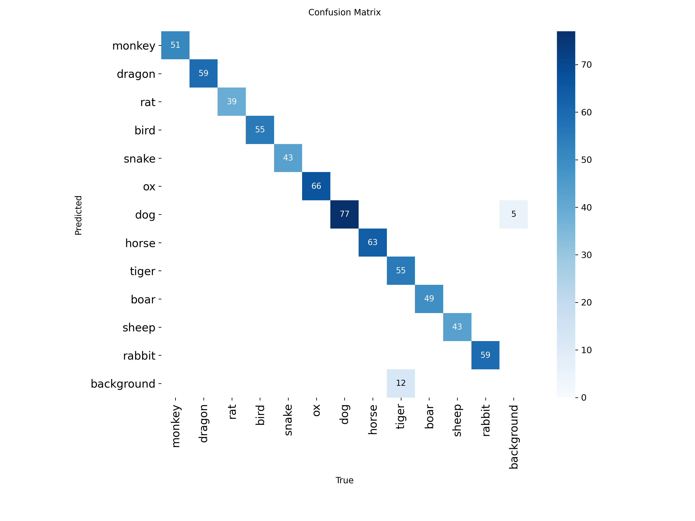

#### Normalized Confusion Matrix
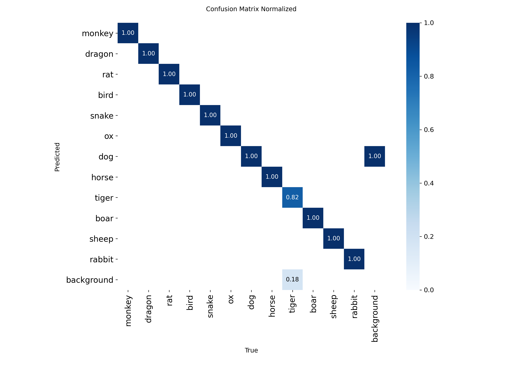

#### Performance Curves
| Metric | Curve |
|--------|--------|
| F1 Score | 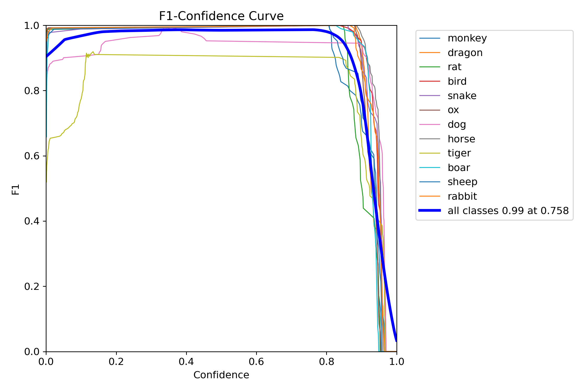 |
| Precision | 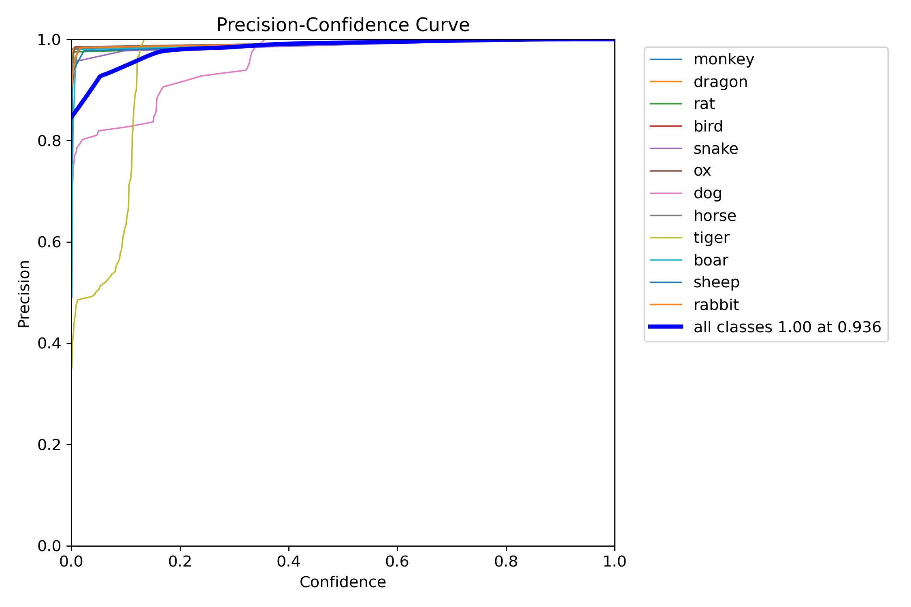 |
| Recall | 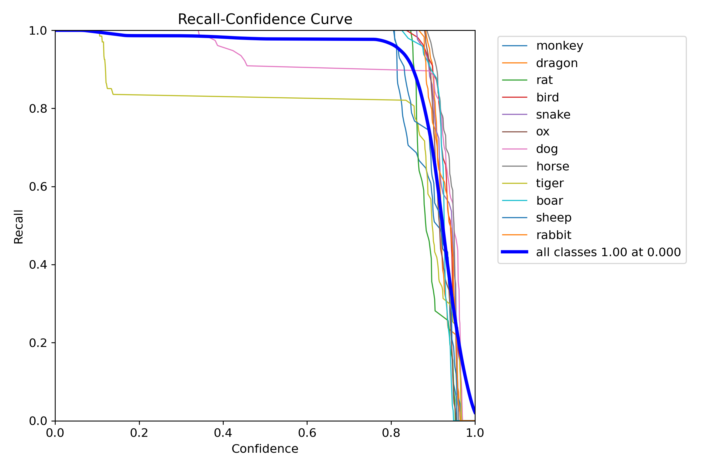 |
| Precision-Recall | 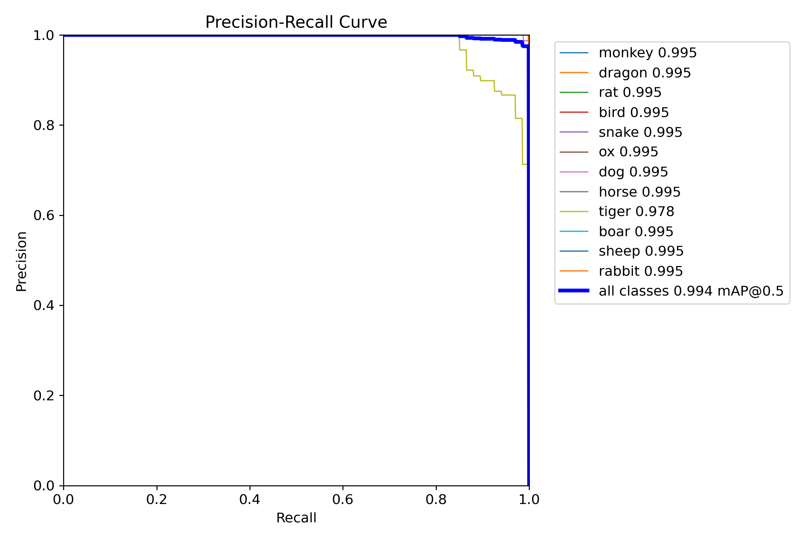 |

#### Detection Results Example
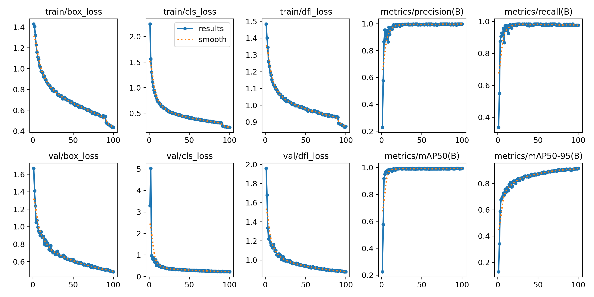
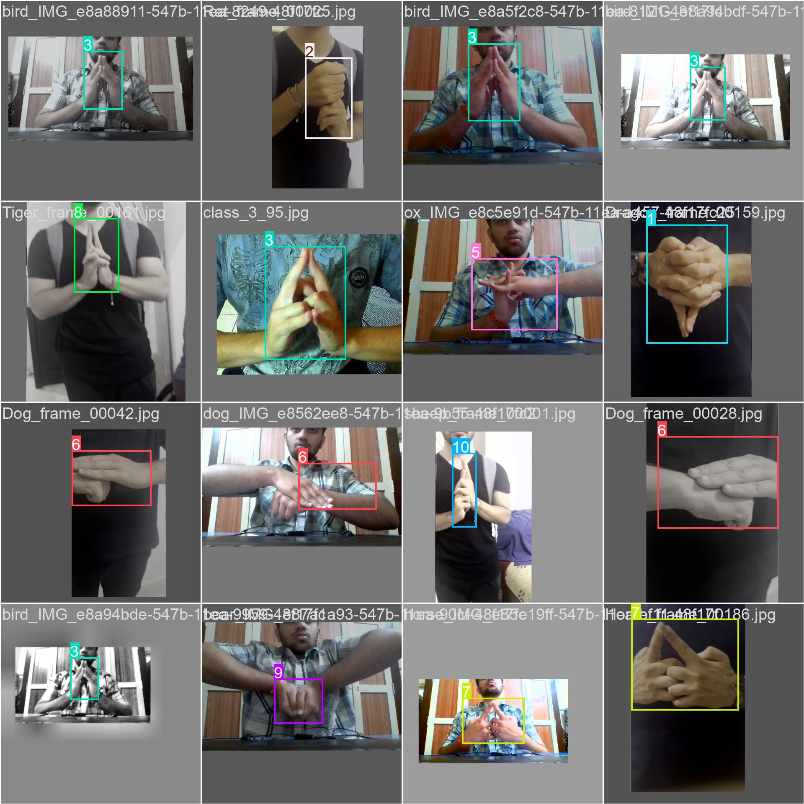

#### Label Visualization
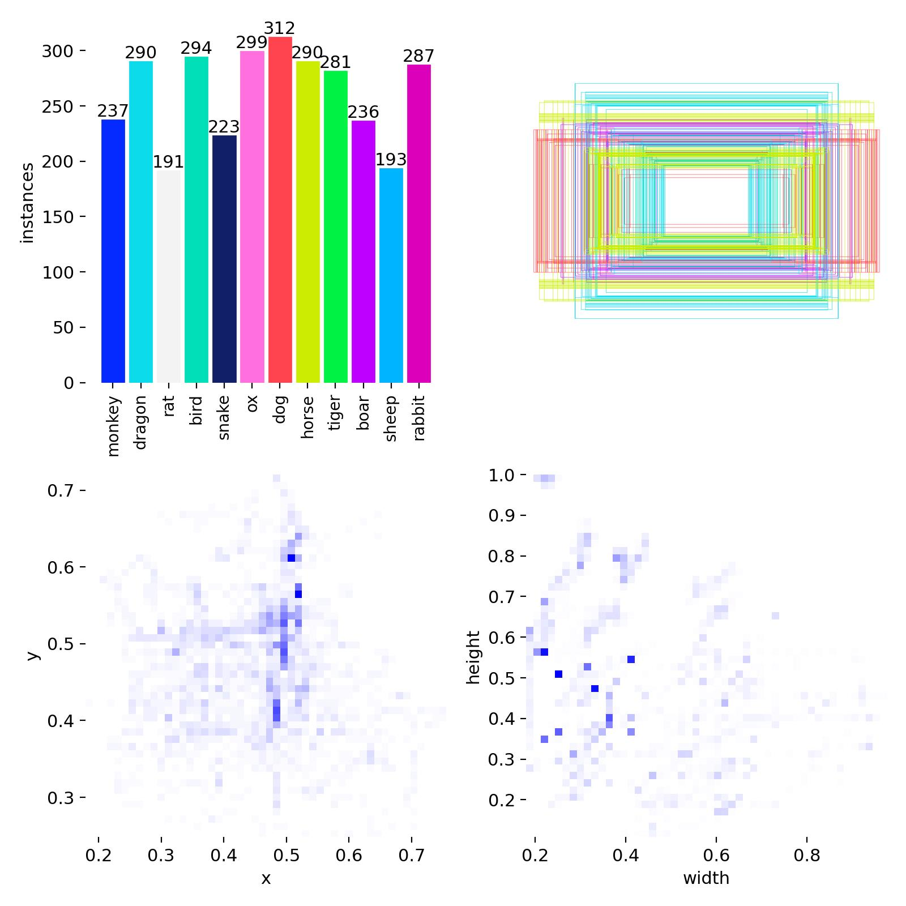

---

### 🎥 Demo
[](assets/demo.mp4)

*(Click to play — GitHub will display it inline if under 25 MB, otherwise as a link.)*

---

### 🧠 Model Summary
- **Model:** YOLOv8n  
- **Framework:** Ultralytics YOLO  
- **Language:** Python  
- **Frontend:** Streamlit  
- **Training Dataset:** Custom Naruto Hand Sign dataset (see below)  
- **Accuracy:** 98%+ across most classes  

---

### 🖼️ UI Icons and Images
| Description | File |
|-------------|------|
| App icon | 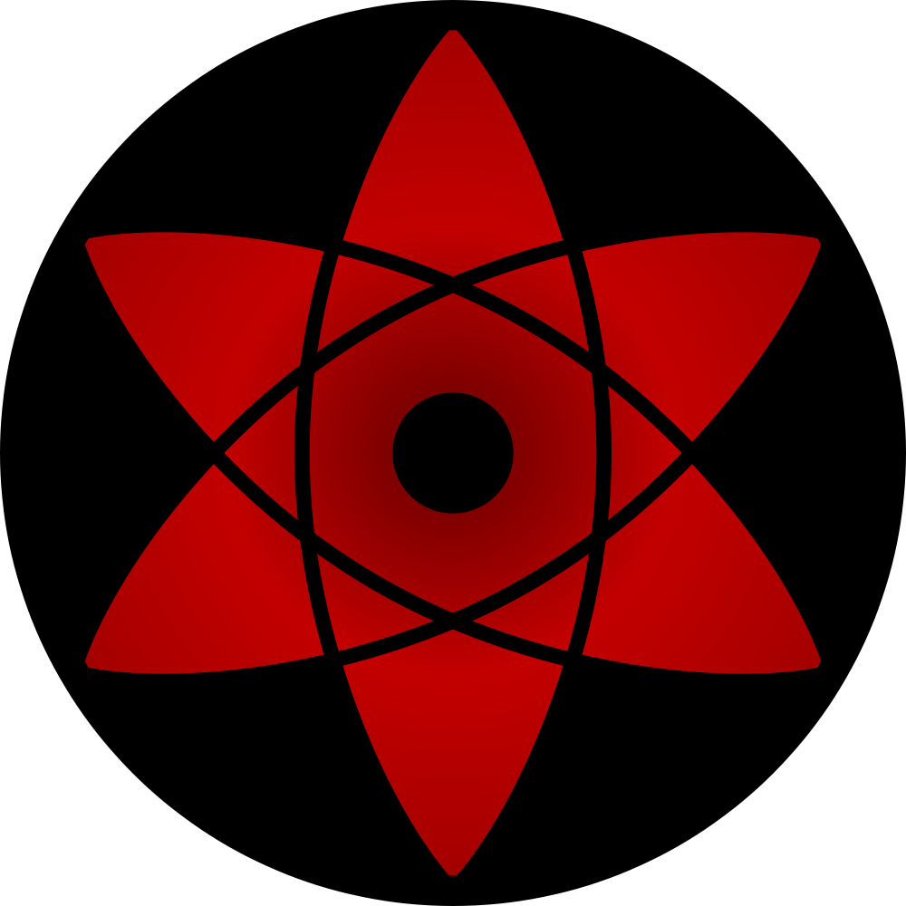 |
| Naruto main | 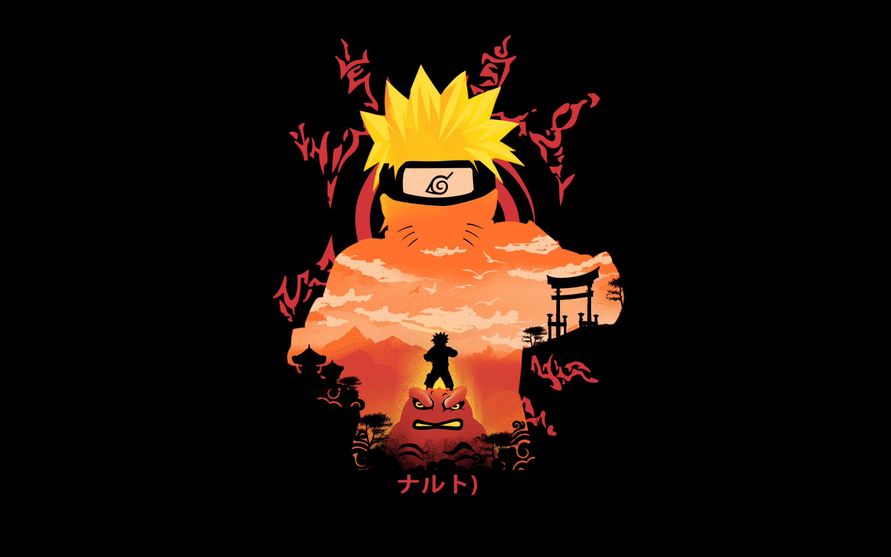 |
| Left image | 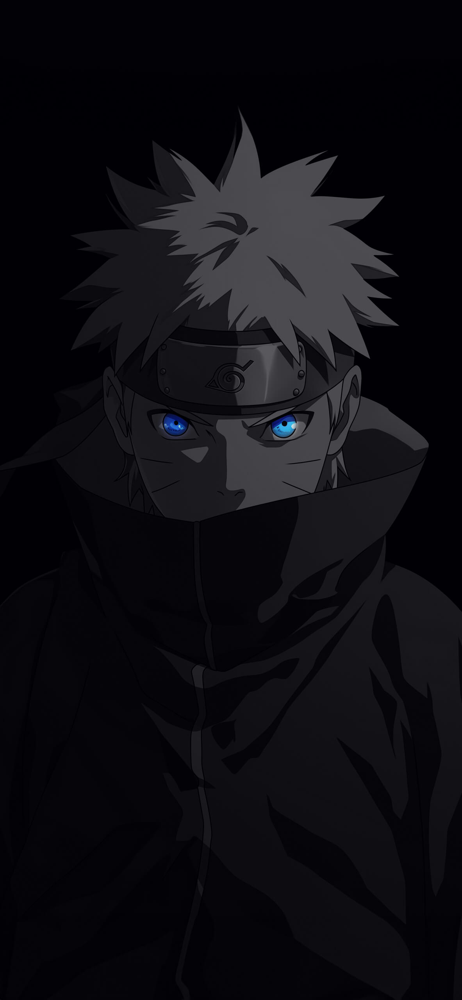 |
| Right image | 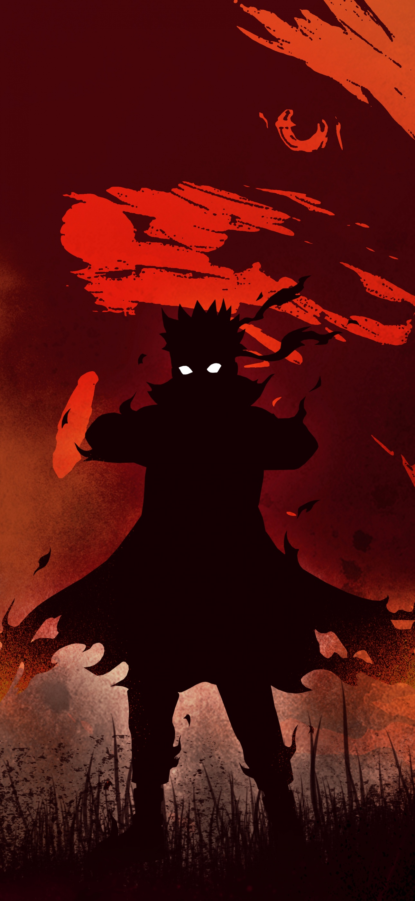 |

---

### 💬 Acknowledgements
This project was inspired by the **Naruto universe** and existing gesture recognition research.  
We also relied on several amazing open-source resources and datasets:

- **[Naruto Hand Sign Dataset – Kaggle](https://www.kaggle.com/datasets/vikranthkanumuru/naruto-hand-sign-dataset)** for initial reference data  
- **[Lucas Fernando’s Hand Sign Detection Project](https://github.com/lucasfernandoprojects/hand-sign-detection)** for structure inspiration and baseline training ideas  
- **Ultralytics YOLOv8** for the detection backbone  
- **Streamlit** for the web interface  
- **CVAT (Computer Vision Annotation Tool)** for creating and labeling our **custom dataset**, which we expanded and re-annotated to improve detection performance.
